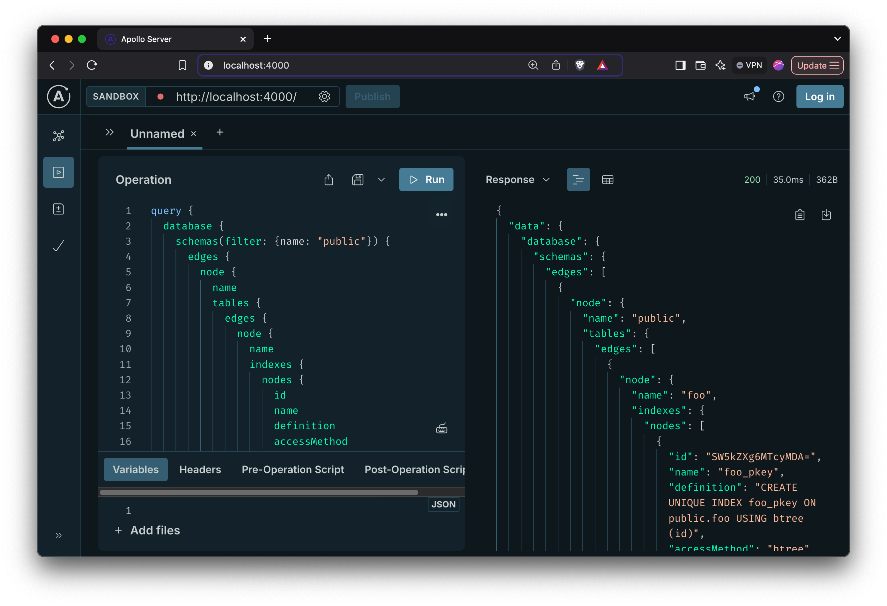

# supastructure


**supastructure** is an experimental GraphQL API server and library. It connects to [Supabase](https://supabase.com/) projects, enabling fine-grained user defined queries of database structure. This project aims to assist AI developer platforms, such as [Bolt.new](https://bolt.new/) and [Lovable.dev](https://lovable.dev/), in extracting fine-grained context from Supabase projects to enhance LLM-generated responses to user prompts.

**Note:**:
- supastructure is not supported by Supabase in any capacity
- the primary goal of this is learning

## Features

- **GraphQL API Server:** GraphQL API server for querying Supabase project structures
- **Embedded GraphQL Explorer:** Access the GraphQL explorer at `http://localhost:4000` for interactive queries
- **Library Usage:** Embed it directly in your node application

## Installation
Ensure you have Node.js and npm installed. Then, follow these steps:

1. Clone the Repository:
```shell
git clone https://github.com/olirice/supastructure.git
cd supastructure
```

2. Install Dependencies
```shell
npm install
```

## Usage

### As an API Server

Start the API Server with
```shell
npm start
```

Then visit `http://localhost:4000` and query your project.




## Testing

To run the test suite, use:

```shell
npm test
```

For continuous testing during development

```shell
npm run test:watch
```

## GraphQL Schema
This schema is undergoing rapid change and may be out of date in the README. For the official source of truth see 

Known things that need to change:
- Privileges aren't buttoned up yet
- Need to add a bunch of other entities
  - Foreign Servers
  - Foreign Tables
  - Extensions
    - Should extensions have associated schemas/functions/views/etc from pg_depends?

```graphql
# src/schema.graphql

"""
Represents objects that can be looked up by a global ID
"""
interface Node {
  id: ID!
}

"""
Information about pagination in a connection
"""
type PageInfo {
  hasNextPage: Boolean!
  endCursor: String
}

enum SortDirection {
  ASC
  DESC
}

type Query {
  database: Database!
  schema(oid: Int, schemaName: String, id: ID): Schema
  table(oid: Int, schemaName: String, name: String, id: ID): Table
  view(oid: Int, schemaName: String, name: String, id: ID): View
  materializedView(oid: Int, schemaName: String, name: String, id: ID): MaterializedView
  index(oid: Int, schemaName: String, name: String, id: ID): Index
  trigger(oid: Int, schemaName: String, name: String, id: ID): Trigger
  policy(oid: Int, schemaName: String, name: String, id: ID): Policy
  type(oid: Int, schemaName: String, name: String, id: ID): PgType
  role(oid: Int, name: String, id: ID): Role
  node(id: ID!): Node
}

type RoleConnection {
  edges: [RoleEdge!]!
  pageInfo: PageInfo!
  nodes: [Role!]!
}

type RoleEdge {
  node: Role!
  cursor: String!
}

"""
Database role from pg_roles
"""
type Role implements Node {
  id: ID!
  """From pg_roles.oid"""
  oid: Int!
  """From pg_roles.rolname"""
  name: String!
  """From pg_roles.rolsuper"""
  isSuperuser: Boolean
}

"""
Database from pg_database
"""
type Database implements Node {
  id: ID!
  """From pg_database.oid"""
  oid: Int!
  """From pg_database.datname"""
  name: String!
  schemas(first: Int, after: String, orderBy: SchemaOrderBy): SchemaConnection!
  privileges(roleName: String!): DatabasePrivilege!
}

input SchemaFilter {
  name: String
  oid: Int
}

enum SchemaOrderByField {
  NAME
  OID
}

input SchemaOrderBy {
  field: SchemaOrderByField
  direction: SortDirection
}

type DatabasePrivilege {
  role: Role!
  connect: Boolean
}

type SchemaConnection {
  edges: [SchemaEdge!]!
  pageInfo: PageInfo!
  nodes: [Schema!]!
}

type SchemaEdge {
  node: Schema!
  cursor: String!
}

"""
Schema/namespace from pg_namespace
"""
type Schema implements Node {
  id: ID!
  """From pg_namespace.oid"""
  oid: Int!
  """From pg_namespace.nspname"""
  name: String!
  tables(first: Int, after: String, orderBy: TableOrderBy): TableConnection!
  views(first: Int, after: String): ViewConnection!
  materializedViews(first: Int, after: String): MaterializedViewConnection!
  privileges(roleName: String!): SchemaPrivilege!
}

type SchemaPrivilege {
  role: Role!
  usage: Boolean
}

input TableFilter {
  name: String
  oid: Int
}

enum TableOrderByField {
  NAME
  OID
}

input TableOrderBy {
  field: TableOrderByField
  direction: SortDirection
}

type TableConnection {
  edges: [TableEdge!]!
  pageInfo: PageInfo!
  nodes: [Table!]!
}

type TableEdge {
  node: Table!
  cursor: String!
}

"""
Table from pg_class where relkind = 'r'
"""
type Table implements Node {
  id: ID!
  """From pg_class.oid"""
  oid: Int!
  """From pg_class.relname"""
  name: String!
  schema: Schema!
  """From pg_class.relrowsecurity"""
  rowLevelSecurityEnabled: Boolean!
  columns: ColumnConnection!
  indexes: IndexConnection!
  policies: PolicyConnection!
  privileges(roleName: String!): TablePrivilege!
}

type TablePrivilege {
  role: Role!
  select: Boolean
  insert: Boolean
  update: Boolean
  delete: Boolean
}

type ColumnConnection {
  edges: [ColumnEdge!]!
  pageInfo: PageInfo!
  nodes: [Column!]!
}

type ColumnEdge {
  node: Column!
  cursor: String!
}

"""
Column from pg_attribute
"""
type Column implements Node {
  id: ID!
  """From pg_attribute.attname"""
  name: String!
  """From pg_attribute.attnum"""
  attnum: Int!
  """From pg_attribute.atttypid"""
  atttypid: Int!
  table: Table!
  type: PgType!
  privileges(roleName: String!): ColumnPrivilege!
}

type ColumnPrivilege {
  role: Role!
  select: Boolean
  insert: Boolean
  update: Boolean
}

type ViewConnection {
  edges: [ViewEdge!]!
  pageInfo: PageInfo!
  nodes: [View!]!
}

type ViewEdge {
  node: View!
  cursor: String!
}

"""
View from pg_class where relkind = 'v'
"""
type View implements Node {
  id: ID!
  """From pg_class.oid"""
  oid: Int!
  """From pg_class.relname"""
  name: String!
  schema: Schema!
  columns: ColumnConnection!
  privileges(roleName: String!): ViewPrivilege!
}

type ViewPrivilege {
  role: Role!
  select: Boolean
}

type MaterializedViewConnection {
  edges: [MaterializedViewEdge!]!
  pageInfo: PageInfo!
  nodes: [MaterializedView!]!
}

type MaterializedViewEdge {
  node: MaterializedView!
  cursor: String!
}

"""
Materialized view from pg_class where relkind = 'm'
"""
type MaterializedView implements Node {
  id: ID!
  """From pg_class.oid"""
  oid: Int!
  """From pg_class.relname"""
  name: String!
  schema: Schema!
  indexes: IndexConnection!
  """From pg_class.relispopulated"""
  populated: Boolean!
  columns: ColumnConnection!
  privileges(roleName: String!): MaterializedViewPrivilege!
}

type MaterializedViewPrivilege {
  role: Role!
  select: Boolean
}

type IndexConnection {
  edges: [IndexEdge!]!
  pageInfo: PageInfo!
  nodes: [Index!]!
}

type IndexEdge {
  node: Index!
  cursor: String!
}

"""
Index from pg_class where relkind = 'i' joined with pg_index
"""
type Index implements Node {
  id: ID!
  """From pg_class.oid"""
  oid: Int!
  """From pg_class.relname"""
  name: String!
  schema: Schema!
  table: Table!
  """From pg_am.amname"""
  accessMethod: String!
  """From pg_get_indexdef()"""
  definition: String
}

type TriggerConnection {
  edges: [TriggerEdge!]!
  pageInfo: PageInfo!
  nodes: [Trigger!]!
}

type TriggerEdge {
  node: Trigger!
  cursor: String!
}

"""
Trigger from pg_trigger
"""
type Trigger implements Node {
  id: ID!
  """From pg_trigger.oid"""
  oid: Int!
  """From pg_trigger.tgname"""
  name: String!
  table: Table!
}

type PolicyConnection {
  edges: [PolicyEdge!]!
  pageInfo: PageInfo!
  nodes: [Policy!]!
}

type PolicyEdge {
  node: Policy!
  cursor: String!
}

"""
Row level security policy from pg_policy
"""
type Policy implements Node {
  id: ID!
  """From pg_policy.oid"""
  oid: Int!
  """From pg_policy.polname"""
  name: String!
  table: Table!
  """From pg_policy.polcmd"""
  command: String
  """From pg_policy.polroles"""
  roles: [String!]
  """From pg_get_expr(polqual, polrelid)"""
  usingExpr: String
  """From pg_get_expr(polwithcheck, polrelid)"""
  withCheck: String
}

"""
Common interface for all PostgreSQL types
"""
interface PgTypeInterface implements Node {
  id: ID!
  """From pg_type.oid"""
  oid: Int!
  """From pg_type.typname"""
  name: String!
  """Derived from pg_type.typtype"""
  kind: TypeKind!
}

enum TypeKind {
  DOMAIN
  SCALAR
  ARRAY
  COMPOSITE
  ENUM
  UNKNOWN
}

type PgTypeConnection {
  edges: [PgTypeEdge!]!
  pageInfo: PageInfo!
  nodes: [PgType!]!
}

type PgTypeEdge {
  node: PgType!
  cursor: String!
}

union PgType = DomainType | ScalarType | EnumType | ArrayType | CompositeType | UnknownType

"""
Domain type from pg_type where typtype = 'd'
"""
type DomainType implements PgTypeInterface & Node {
  id: ID!
  oid: Int!
  name: String!
  kind: TypeKind!
  """References pg_type.typbasetype"""
  baseType: PgType
}

"""
Base scalar type from pg_type where typtype = 'b'
"""
type ScalarType implements PgTypeInterface & Node {
  id: ID!
  oid: Int!
  name: String!
  kind: TypeKind!
}

"""
Enum type from pg_type where typtype = 'e'
"""
type EnumType implements PgTypeInterface & Node {
  id: ID!
  oid: Int!
  name: String!
  kind: TypeKind!
  """From pg_enum.enumlabel values"""
  enumVariants: [String!]!
}

"""
Array type from pg_type where typtype = 'b' and typelem != 0
"""
type ArrayType implements PgTypeInterface & Node {
  id: ID!
  oid: Int!
  name: String!
  kind: TypeKind!
  """References pg_type.typelem"""
  elementType: PgType
}

type CompositeField {
  name: String!
  type: PgType!
  """From pg_attribute.attnotnull"""
  notNull: Boolean
}

"""
Composite type from pg_type where typtype = 'c'
"""
type CompositeType implements PgTypeInterface & Node {
  id: ID!
  oid: Int!
  name: String!
  kind: TypeKind!
  """Composite fields from pg_attribute"""
  fields: [CompositeField!]!
}

"""
Unknown/unsupported type
"""
type UnknownType implements PgTypeInterface & Node {
  id: ID!
  oid: Int!
  name: String!
  kind: TypeKind!
}
```

## How to Contribute

Please open an issue to discuss the problem you'd like to solve before opening any PRs
